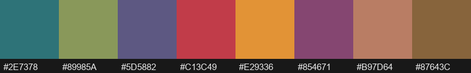
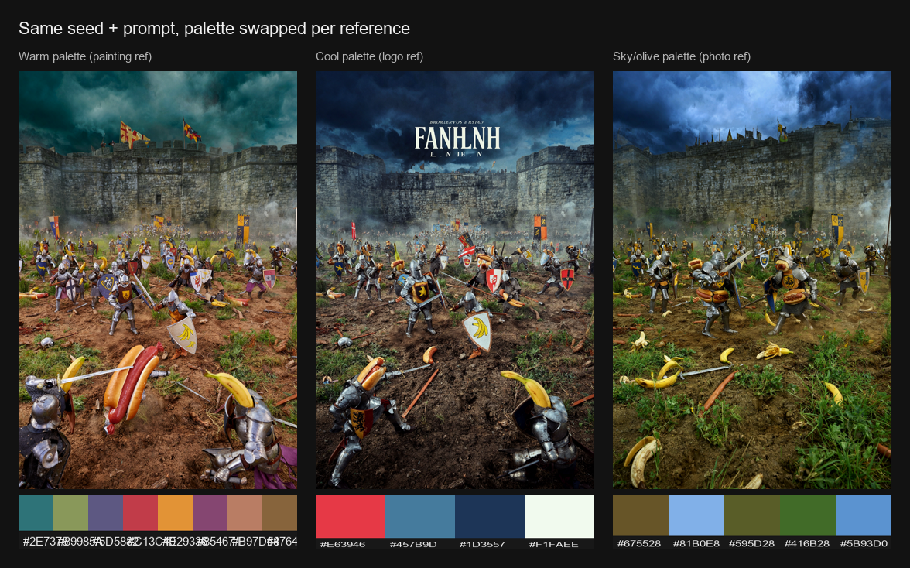

# ComfyUI-Ideogram-Palette-and-Prompt-Tools

*Pick the palette. Skip the hex-code spreadsheet.*


A ComfyUI toolkit for Ideogram 4's structured prompt JSON, built around color
palette extraction: pull palettes from reference images, assemble and validate
the full Ideogram JSON, and embed/recover prompts from generated images — all
as composable nodes that wire into a ComfyUI generation workflow.

## Table of Contents

- [Installation](#installation)
- [Why This Exists](#why-this-exists)
- [What it does](#what-it-does)
- [Nodes](#nodes)
- [Example workflow](#example-workflow)
- [Palette studies (same image, different palettes)](#palette-studies-same-image-different-palettes)
- [Showcase workflows](#showcase-workflows)
- [Design notes](#design-notes)
- [Testing](#testing)
- [License](#license)

## Installation

Clone (or copy) this repository into your ComfyUI `custom_nodes/` directory and
restart ComfyUI:

```
cd ComfyUI/custom_nodes
git clone https://github.com/SurrealByDesign/ComfyUI-Ideogram-Palette-and-Prompt-Tools
```

The only extra dependency is **scikit-learn** (used for k-means clustering),
which is not part of a base ComfyUI install. ComfyUI-Manager installs it
automatically from [`requirements.txt`](requirements.txt); to install it by
hand into ComfyUI's Python:

```
pip install scikit-learn
```

The package also uses `torch`, `numpy`, and `Pillow`, but those ship with
ComfyUI and are **deliberately not** listed in `requirements.txt` — reinstalling
them (torch especially) can pull a build that doesn't match your ComfyUI/CUDA
setup and break the install. After restarting, the twelve nodes appear in the
node menu under **`Ideogram/Palette`**.

## Why This Exists

Ideogram 4's most powerful prompting feature — structured JSON prompts with
explicit, ordered color palettes — is also the most tedious to use by hand:
picking a dozen consistent hex codes, getting the nested JSON key order right,
and keeping per-element palettes within Ideogram's limits is easy to get
wrong. This toolkit automates that part of the process — extract a palette
directly from a reference image, validate and assemble it into the exact JSON
shape Ideogram expects, and round-trip the prompt through your saved images —
so the creative decision stays in ComfyUI's node graph instead of a text
editor.

## What it does

Ideogram 4 accepts color palettes as ordered hex arrays inside its
`style_description` (global) and `compositional_deconstruction` (per-element)
prompt schema. Picking those colors by hand is tedious and easy to get wrong —
this package extracts them automatically from a reference image using k-means
clustering, filters out near-duplicate colors using perceptual (Delta-E / LAB)
distance rather than raw RGB distance, and emits JSON in the exact key order
Ideogram 4 expects.

Each extracted color is shown on a labeled swatch strip (exact hex code below
each block — the same value Ideogram consumes):



Because the palette is injected into the prompt conditioning, swapping it while
holding the seed and prompt fixed recolors the same scene — useful for colorway
studies:



## Nodes

### Ideogram Palette Extractor (`IdeogramPaletteExtractor`)
Takes a reference image, runs k-means clustering, removes near-duplicate
colors with Delta-E filtering, and returns colors ordered by prominence.

- **Inputs:** `image`, `num_colors` (2-16, default 8), `min_delta_e` (default 10.0)
- **Outputs:** `palette_json` (hex array string), `palette_preview` (swatch strip image), `color_count`

### Ideogram Palette -> Global JSON (`IdeogramPaletteToGlobalJSON`)
Wraps a palette JSON string into a partial Ideogram 4 `style_description`
fragment with correct key ordering (`aesthetics` -> `lighting` -> `color_palette`).

- **Inputs:** `palette_json`, optional `aesthetics`, optional `lighting`
- **Outputs:** `style_json`

### Ideogram Palette Override (`IdeogramPaletteOverride`)
Manually tweak an extracted palette before finalizing it — add hex colors,
remove specific indices, and clamp the total count.

- **Inputs:** `palette_json`, `max_colors` (default 16), optional `add_colors` (comma-separated hex), optional `remove_index` (comma-separated indices)
- **Outputs:** `palette_json`, `palette_preview`

### Ideogram Element Palette (`IdeogramElementPalette`)
Same extraction pipeline as the extractor, clamped to a maximum of 5 colors for
Ideogram 4's per-element `compositional_deconstruction` color palettes.

- **Inputs:** `image`, `num_colors` (1-5, default 5), `min_delta_e` (default 10.0)
- **Outputs:** `element_palette_json` (max 5 hex strings), `palette_preview`

### Ideogram Masked Palette Extractor (`IdeogramMaskedPaletteExtractor`)
Extracts a palette from only the **masked region** of an image — the palette of a
specific subject or area rather than the whole frame. Pairs with
`IdeogramElementPalette` to build region-accurate per-element palettes (mask the
subject → its true colors). Same k-means + Delta-E pipeline, restricted to the
selected pixels.

- **Inputs:** `image`, `mask` (MASK), `num_colors` (2-16, default 8), `min_delta_e` (default 10.0), `mask_threshold` (0.0-1.0, default 0.5)
- **Outputs:** `palette_json`, `palette_preview`, `color_count`
- An empty / below-threshold mask falls back gracefully to a single gray swatch.

### Ideogram Vibrant Palette Extractor (`IdeogramVibrantPaletteExtractor`)
Ranks colors by **vibrancy instead of frequency**, so a small but striking accent
color isn't buried under a dull dominant background (which the frequency-based
extractor would rank first). Inspired by Android's Palette API / Vibrant.js: each
clustered color is scored against a target saturation + lightness (weighted with
population), and `mode` selects which target to emphasize.

- **Inputs:** `image`, `num_colors` (2-16, default 8), `min_delta_e` (default 10.0), `mode` (`vibrant` / `light_vibrant` / `dark_vibrant` / `muted` / `light_muted` / `dark_muted`, default `vibrant`)
- **Outputs:** `palette_json` (most-vibrant-for-the-mode first), `palette_preview`, `color_count`

### Ideogram Metadata Embedder (`IdeogramMetadataEmbedder`)
A terminal **save** node: writes the generated image to the ComfyUI output
directory with the Ideogram 4 JSON prompt embedded in a PNG `tEXt` metadata
chunk, so the prompt travels with the file. It also preserves ComfyUI's normal
`prompt`/workflow metadata, so the saved PNG stays reproducible in ComfyUI.

Wire it where you'd normally put a `SaveImage` node (e.g. after your sampler's
`VAEDecode`). Because ComfyUI's `IMAGE` type is a bare tensor that carries no
metadata, embedding can only happen at save time — so this node owns the save
rather than passing the image through.

- **Inputs:** `image`, `prompt_json`, `filename_prefix` (default `"ideogram"`), `embed_key` (default `"ideogram_prompt"`)
- **Output:** `metadata_preview` (confirmation string; the node also previews the saved image)
- **Note:** `tEXt` metadata is a PNG feature — re-saving the file as JPEG elsewhere destroys the embedded prompt.

### Ideogram Palette Blend (`IdeogramPaletteBlend`)
Blends two palettes into one — e.g. mixing a content-reference palette with a
style-reference palette. `blend_ratio` controls the proportion (0.0 = all A,
1.0 = all B); colors are drawn from each in dominance order, interleaved, with
exact-duplicate hexes removed and the result clamped to `max_colors`.

- **Inputs:** `palette_a`, `palette_b`, `blend_ratio` (0.0-1.0, default 0.5), `max_colors` (default 8)
- **Outputs:** `palette_json`, `palette_preview`

### Ideogram JSON Validator (`IdeogramJSONValidator`)
Validates an Ideogram 4 prompt JSON string against the schema's structural rules
and optionally corrects key ordering. Checks: valid JSON, presence of the three
top-level keys, hex-color validity, global palette ≤ 16 colors, per-element
palettes ≤ 5 colors, and bounding-box coordinates within 0–1000. It reorders
keys only — it never edits content values.

- **Inputs:** `prompt_json`, `fix_key_order` (BOOLEAN, default True), `strict_mode` (BOOLEAN, default False — when on, warnings also fail validation)
- **Outputs:** `prompt_json` (optionally key-reordered), `is_valid` (BOOLEAN), `report` (human-readable summary)

### Ideogram Metadata Reader (`IdeogramMetadataReader`)
Reads an embedded Ideogram JSON prompt back out of a PNG `tEXt` chunk by key.

- **Inputs:** `image`, `embed_key` (default `"ideogram_prompt"`)
- **Outputs:** `prompt_json` (recovered string, or `""`), `status`
- **Note:** a ComfyUI `IMAGE` tensor carries no metadata, so this only recovers a
  prompt when the image still carries its `.info`. A standard `LoadImage → IMAGE`
  path strips `tEXt` chunks. For reading prompts from saved files, use the
  file-based loader below instead.

### Ideogram Load Image With Prompt (`IdeogramLoadImageWithPrompt`)
The working counterpart to the metadata reader: loads a PNG **from disk by path**
and recovers its embedded Ideogram prompt — closing the loop with
`IdeogramMetadataEmbedder` (embed on save, recover on load). Because the metadata
lives in the file (not the tensor), reading from the path is what actually works.

- **Inputs:** `image_path` (absolute, or relative to ComfyUI's output/input dirs), `embed_key` (default `"ideogram_prompt"`)
- **Outputs:** `image` (IMAGE), `prompt_json` (recovered, or `""`), `status`
- Always returns a valid IMAGE (a small black tensor on failure), so the graph never breaks.

### Ideogram Prompt Assembler (`IdeogramPromptAssembler`)
The link between palette extraction and a full generation prompt: deep-merges a
JSON fragment into a base prompt JSON. Wire the `style_description` fragment from
`IdeogramPaletteToGlobalJSON` in as `merge_json` and your complete prompt JSON as
`base_json`, and it injects the palette field-by-field — replacing only
`style_description.color_palette` while leaving sibling fields (`aesthetics`,
`lighting`, `photo`, `medium`) and the rest of the prompt untouched. A `base_json`
of `"{}"` lets it assemble a prompt from scratch.

- **Inputs:** `base_json` (default `"{}"`), `merge_json`, `fix_key_order` (BOOLEAN, default True)
- **Outputs:** `prompt_json` (merged, key-ordered), `report` (what was merged)

## Example workflow

[`workflows/palette_reference_workflow.json`](workflows/palette_reference_workflow.json)
demonstrates the core pipeline:

```
LoadImage -> IdeogramPaletteExtractor -> IdeogramPaletteOverride -> IdeogramPaletteToGlobalJSON
                                    \-> PreviewImage (swatch strip)
```

Load it via ComfyUI's **Workflow → Open** menu. It wires a reference image
through extraction, manual override, and final JSON wrapping, with the swatch
preview displayed alongside. The `style_json` output can be merged into a
full Ideogram 4 prompt payload (e.g. with a JSON-merge node, or pasted
directly if building the prompt by hand).

## Palette studies (same image, different palettes)

To generate the *same composition recolored by several reference palettes*, the
palette must vary while the seed and prompt stay fixed. Because each palette
lives inside the prompt JSON (a separate conditioning), and ComfyUI draws
different noise per batch item, this requires **separate generations sharing one
seed** — not a single batched run. Two ways to do it:

- **Batch CLI ([`tools/palette_batch.py`](tools/palette_batch.py))** — scales to
  any number of references. Point it at a base workflow (API format) and a
  folder of images; it extracts each palette, injects it, locks the seed, and
  queues one generation per reference, saving outputs plus a `manifest.json`:

  ```
  python tools/palette_batch.py --workflow my_workflow_api.json \
      --images refs/ --seed 1078 --out out/study
  ```

  It auto-detects the seed and prompt nodes (override with `--seed-node-id` /
  `--prompt-node-id`). `--inject-mode` is `auto` by default: it sets
  `style_description.color_palette` when the prompt is Ideogram JSON, or appends
  a textual palette hint when it's plain text. Run it with a Python that can
  reach your ComfyUI server (e.g. the embedded `python_embeded\python.exe`).

- **In-graph 3-way ([`workflows/palette_study_3way_workflow.json`](workflows/palette_study_3way_workflow.json))**
  — good for eyeballing 2–3 colorways live on the canvas. Three reference images
  each produce a `style_json`; wire each into its own copy of your
  CLIPTextEncode → KSampler → VAEDecode chain with the **same seed** and
  `batch_size=1` on every sampler.

## Showcase workflows

A set of five ready-to-load workflows under [`workflows/`](workflows/) that
demonstrate the nodes working together, from a single extraction up to a full
extract → assemble → validate → embed pipeline. Load any of them via ComfyUI's
**Workflow → Open** menu and point the `LoadImage` node(s) at your own reference.

| Workflow | What it shows | Nodes wired together |
| --- | --- | --- |
| [`showcase_01_palette_to_prompt_pipeline.json`](workflows/showcase_01_palette_to_prompt_pipeline.json) | The flagship chain: a reference image becomes a complete, validated Ideogram 4 prompt with the embedded palette, saved to disk. | Extractor → Override → Palette→Global JSON → Prompt Assembler → JSON Validator → Metadata Embedder |
| [`showcase_02_blend_content_and_style.json`](workflows/showcase_02_blend_content_and_style.json) | Mix a **content** reference palette with a **style** reference palette (tune `blend_ratio`), then build and save a prompt from the blend. | 2× Extractor → Palette Blend → Palette→Global JSON → Prompt Assembler → JSON Validator → Metadata Embedder |
| [`showcase_03_vibrant_vs_frequency.json`](workflows/showcase_03_vibrant_vs_frequency.json) | Same image, four rankings side by side — the default frequency extractor vs. the Vibrant Extractor in `vibrant` / `muted` / `dark_vibrant` modes. | Extractor + 3× Vibrant Extractor → Palette→Global JSON |
| [`showcase_04_masked_subject_and_global.json`](workflows/showcase_04_masked_subject_and_global.json) | Build a structured prompt with **two** palettes: a region-accurate per-element palette from a masked subject, plus the global palette from the whole frame. | Masked Extractor → Override (≤5) ‖ Element Palette ‖ Extractor → Palette→Global JSON |
| [`showcase_05_embed_recover_roundtrip.json`](workflows/showcase_05_embed_recover_roundtrip.json) | The metadata loop closing: embed a prompt on save, then recover it from the saved PNG by path (and why the tensor-based reader can't). | Extractor → Palette→Global JSON → Prompt Assembler → Metadata Embedder … Load Image With Prompt → JSON Validator (+ Metadata Reader caveat) |

A few notes that apply across the set:

- **Text-display nodes are optional.** Where a workflow shows a raw JSON string it
  uses `ShowText|pysssss` (from [ComfyUI-Custom-Scripts](https://github.com/pythongosssss/ComfyUI-Custom-Scripts)).
  These are clearly marked and can be deleted or swapped for any STRING-display
  node — the core pipeline runs without them. All swatch previews use the stock
  `PreviewImage` node, and the Metadata Embedder previews its own saved image.
- **Generation is left to you.** These workflows produce a finished `prompt_json`;
  feed that into whatever Ideogram generation node you use (an API node, or a text
  encoder for a local model). This mirrors the colorway-study workflows, which
  deliberately stop at `style_json` so they stay backend-agnostic.
- Workflow 05 has two halves — run **Part A first** so it writes the PNG that
  **Part B** then loads back by path.

## Design notes

- **Delta-E, not RGB distance.** Two colors that are mathematically close in
  RGB can look wildly different to the eye (and vice versa). All
  deduplication uses CIE76 Delta-E in LAB space (see [`utils/color_utils.py`](utils/color_utils.py)).
- **Fails gracefully.** Every node has a fallback (e.g. flat gray `#808080`)
  so a bad or degenerate image (single color, tiny image, parse errors) never
  crashes the workflow — it just produces a less interesting palette.
- **Strict key ordering.** This package always emits `aesthetics` -> `lighting` ->
  `color_palette` inside `style_description` (see the field order documented
  for each node in [Nodes](#nodes)), since Ideogram 4 is sensitive to JSON key
  order in structured prompts.

## Testing

Run the test suite from the package root:

```
python tests/test_color_utils.py        # RGB<->LAB, Delta-E, hex helpers
python tests/test_extractor.py           # extractor + element palette on 4 image types
python tests/test_palette_override.py    # add/remove/clamp + fallbacks
python tests/test_palette_to_json.py     # key ordering + schema fallbacks
python tests/test_metadata_embedder.py   # PNG tEXt metadata persistence + fallbacks
python tests/test_palette_blend.py       # ratio weighting, dedup, clamp + fallbacks
python tests/test_metadata_reader.py     # tEXt recovery + missing-key handling
python tests/test_json_validator.py      # schema validation, key-order fix, limits
python tests/test_prompt_assembler.py    # deep merge, palette injection, key order
python tests/test_metadata_file_reader.py # load PNG by path + recover prompt
python tests/test_masked_palette_extractor.py # region-restricted extraction
python tests/test_vibrant_palette_extractor.py # vibrancy ranking vs frequency
python tests/test_workflows.py                 # workflow JSONs match node signatures, no dangling links
```

`test_extractor.py` exercises the extraction core against four synthetic
stand-ins for the required test cases (photograph-like gradient, flat-color
logo, multi-color painting blend, near-monochrome fog/snow) under
[`tests/test_images/`](tests/test_images/). The four palette extraction/format
nodes have also been validated against real Ideogram 4 generations in a live
ComfyUI install; the metadata embedder, palette blend, metadata reader, JSON
validator, prompt assembler, file-based image/prompt loader, masked palette
extractor, and vibrant palette extractor have full unit-test coverage and are
pending live verification.

## License

Released under the [MIT License](LICENSE).
